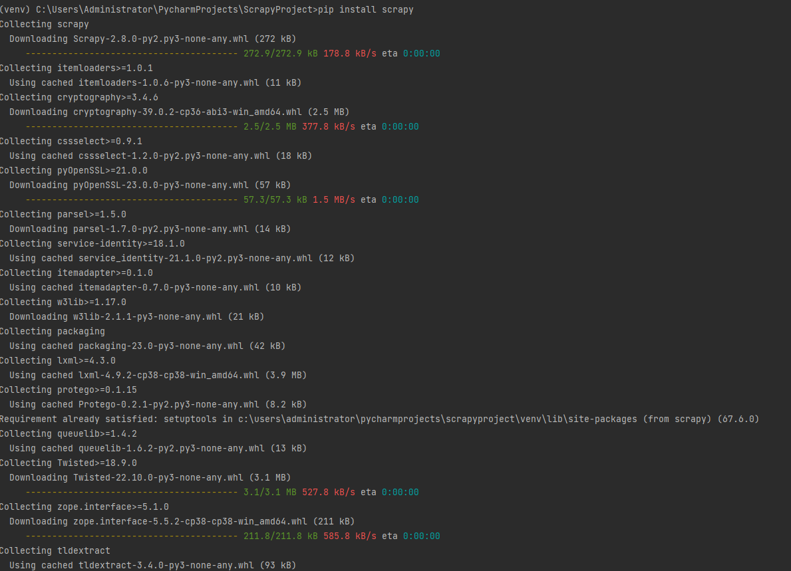
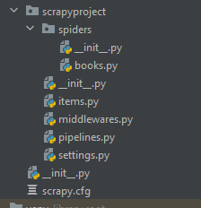
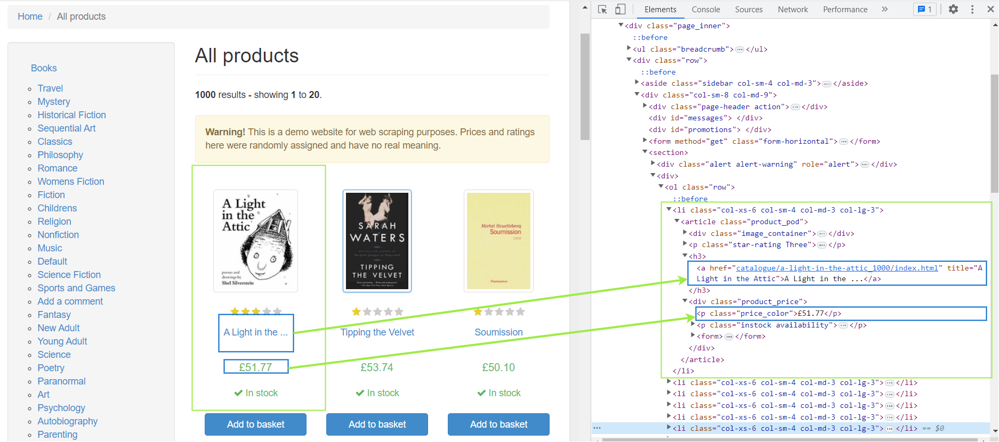
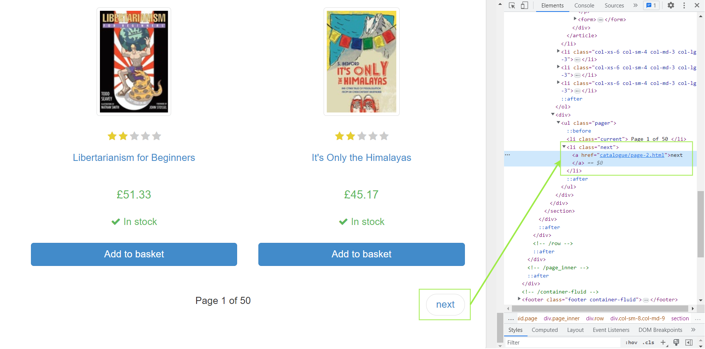

# Web Scraping with Scrapy: Python Tutorial


## How to use Scrapy

This section briefly explains setting up a Scrapy project for web scraping use cases. Creating a Scrapy project for web scraping in Python is a simple three-step procedure. 

1. Install Scrapy
2. Create a Scrapy project
3. Generate a new Spider for your web-scraping target 

Let’s start by installing the Srapy. Open your Python command terminal and type the following pip command:

```Bash
pip install scrapy
```

Scrapy would take a few minutes to complete the installation, depending on your internet connection speed.



Once the installation for the Scrapy gets complete, you can start creating Scrapy projects using the following command:

```bash
scrapy startproject <project_name>
```

You need to replace `<project_name>` with the actual name of your project. For example, the next command will create a new Scrapy project named **scrapyproject**.

```Bash
scrapy startproject scrapyproject
```

Executing the above command creates a new folder named “scrapyproject” in the current directory context and places all the project files in it. 

To generate your first spider, you need to change your current directory to this “scrapyproject” folder using the `cd scrapyproject` command. Now, you can generate a new spider with the following command:

```Bash
scrapy genspider <spider_name> <url_domain>
```

Replace `<spider_namer>` and `<url_domain>` with your actual name for the spider and the web scraping target, respectively. For example, the following command will generate a “books” spider with a target URL [books.toscrape.com](http://books.toscrape.com/).

```Bash
scrapy genspider books books.toscrape.com
```

Congratulations! 🎉 We just completed the initial setup for our Scrapy web scraper. Here is what the project folder looks like:



### Scrapy project structure

Each Scrapy project has the following files and folders: -

- **spiders folder:** Contains spiders for defining how to extract data from specific websites. Each spider is designed to target a specific website or set of websites. Typically, a spider contains a set of rules that dictate how to navigate the site and extract the desired data.
- **items.py:** Contains objects that represent the data a spider is trying to extract. Items are defined using Python classes and help organize the data in a structured format.
- **middleware.py:** This file contains middleware information for request routing. You can also write the [custom proxy middleware](https://oxylabs.io/resources/integrations/scrapy-proxy) in this file.
- **pipelines.py:** Once the spider completes the data extraction, we need to process and store the data in a structured format. Pipelines define a set of processing steps on data while it is being extracted.
- **settings.py:** It contains various configuration settings that control the behavior of the Scrapy framework. For example, you can set user agent string, configure download delay, limit maximum concurrent requests, configure middleware, etc.
- **Scrapy.cfg:** A plain text file that contains a series of configuration directives. For example, it includes directives for the project name, the location of the spider modules, and the settings to be used when running the spiders.

You are encouraged to read [Scrapy’s documentation](https://docs.scrapy.org/en/latest/) page for more information on the basic project structure. Let’s now see how to customize the Scrapy project to serve our web scraping needs.

## Customizing Scrapy Spider

This section discusses customizing a Scrapy project to scrape all the books’ information on the [Books Store](http://books.toscrape.com/). Before jumping into the coding, let’s look at our [initial target](http://books.toscrape.com/) page.



Notice the book title is in the `title` attribute of the `<a>` tag inside an <h3> element. This `<h3>` element is enclosed by an `<article>` tag with the `product_pod` class. Similarly, the book price resides in a `<p>` tag with the `price_color` tag. 

The target page lists only the first 20 books of 1000 books. Therefore, there would be a total of 50 pages. Let’s see the bottom of the same to know the CSS selector for the next page link. 



The URL for the next page is available in the `href` attribute of the `<a>` tag. This `<a>` is enclosed by an `<li>` tag with the `next` class. Mind this information; we will use it in the subsequent section. 

### Scrapy Spider Customization in Action

Open the `books.py` spider file in an IDE of your choice. Replace the original template script with the following code:

```python
 class BooksSpider(scrapy.Spider):
    name = 'books'

    def start_requests(self):
        URL = 'https://books.toscrape.com/'
        yield scrapy.Request(url=URL, callback=self.response_parser)

    def response_parser(self, response):
        for selector in response.css('article.product_pod'):
            yield {
                'title': selector.css('h3 > a::attr(title)').extract_first(),
                'price': selector.css('.price_color::text').extract_first()
            }

        next_page_link = response.css('li.next a::attr(href)').extract_first()
        if next_page_link:
            yield response.follow(next_page_link, callback=self.response_parser)

```

The above script contains two generators: the `start_requests()` and the `response_parser()`. The `start_requests()` generator automatically executes whenever a crawl command is issued to this spider. Here, it retrieves the contents from the URL and issues a call back to the `response_parser()`. 

The `response_parser()` generator, when executed, extracts the desired product information from the iterable `response`. When yields for all the 20 products in the current response are completed, it uses the `response.follow()` method to retrieve the contents of the next page. The `follow()` method calls back to the `reponse_parser()` again to extract and yield products from the new page. The cycle continues until the `next_page_link` becomes NULL or empty. 

You can execute the Scrapy project by issuing a crawl command from the command terminal:

```Bash
scrapy crawl books
```

We can also give a file name with the `-o` option to write the output to a file.

```bash
scrapy crawl -o out.csv books
```

### Running a Scrapy project from within the Python script

You might find it inconvenient to issue a crawl command from a command terminal to execute the project. Luckily, you can execute a Scrapy project from within the Python script.

The following spider script, when executed, automatically issues a crawl command and saves the output in the **books_data.csv** file. 

```python
import csv
import scrapy
from scrapy import signals
from scrapy.crawler import CrawlerProcess
from scrapy.signalmanager import dispatcher

class BooksSpider(scrapy.Spider):
    name = 'books'

    def start_requests(self):
        URL = 'https://books.toscrape.com/'
        yield scrapy.Request(url=URL, callback=self.response_parser)

    def response_parser(self, response):
        for selector in response.css('article.product_pod'):
            yield {
                'title': selector.css('h3 > a::attr(title)').extract_first(),
                'price': selector.css('.price_color::text').extract_first()
            }

        next_page_link = response.css('li.next a::attr(href)').extract_first()
        if next_page_link:
            yield response.follow(next_page_link, callback=self.response_parser)


def book_spider_result():
    books_results = []

    def crawler_results(item):
        books_results.append(item)

    dispatcher.connect(crawler_results, signal=signals.item_scraped)
    crawler_process = CrawlerProcess()
    crawler_process.crawl(BooksSpider)
    crawler_process.start()
    return books_results


if __name__ == '__main__':
    books_data=book_spider_result()

    keys = books_data[0].keys()
    with open('books_data.csv', 'w', newline='') as output_file_name:
        writer = csv.DictWriter(output_file_name, keys)
        writer.writeheader()
        writer.writerows(books_data)

```

The `start_requests()` and `response_parser()` are the same as our previous code. The `__main__` serves as a starting point for direct execution. It calls the `book_spider_result()` function and waits for it to return a value.

The `book_spider_result()` works as follows: -

1. Sets control dispatcher to execute the `crawler_results()` function on the encounter of an `item_scraped` signal. The `item_scraped` is generated whenever the spider scrapes an item from the target.
2. Creates a crawler process for the `BooksSpider`and starts it.
3. Whenever the `BookSpider` completes scraping an item, it emits the `item_scraped` signal. This causes the `crawler_results()` function to execute and append this scraped item to the `books_results` list.
4. Once the crawler process finishes scraping the items, the `book_spider_result()` returns the `books_results` list.

The `__main__` function on return writes the returned `books_data` to the “books_data.csv” file.

Here is what the output file looks like:


